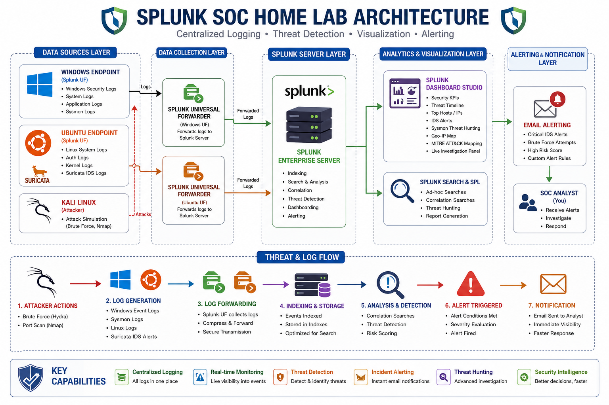

# 🛡️ Splunk SOC Home Lab

> **Enterprise Security Operations Center (SOC) Home Lab built using Splunk Enterprise, Sysmon, Suricata IDS, Ubuntu, Windows, and Splunk Dashboard Studio with AI-assisted dashboard engineering.**


---

# 📖 Overview

This project demonstrates the design and implementation of an **Enterprise-style Security Operations Center (SOC) Home Lab** using **Splunk Enterprise** as the Security Information and Event Management (SIEM) platform.

The objective was to build a centralized environment capable of collecting logs from multiple operating systems, detecting malicious activities, visualizing security events through an advanced SOC dashboard, and automatically notifying analysts through email alerts.

Unlike basic Splunk labs that focus only on log collection, this project simulates the workflow followed by a real SOC—from endpoint telemetry collection to threat detection, investigation, visualization, and incident notification.

---

# 🏗️ Architecture Overview

The following diagram illustrates the complete architecture of the Splunk SOC Home Lab, including data sources, log collection, SIEM processing, dashboard visualization, automated alerting, and the end-to-end threat detection workflow.

<p align="center">
  
</p>

> **Figure:** End-to-end architecture showing Windows and Ubuntu endpoints, Splunk Universal Forwarders, Splunk Enterprise, Dashboard Studio, Email Alerting, and the complete threat & log flow.

---

# 🚀 Project Workflow

The complete security pipeline follows the workflow below.

```
Windows Endpoint
(Default Logs + Sysmon)
        │
        │
        ▼
Splunk Universal Forwarder
        │
        │
        ▼

Ubuntu Endpoint
(Default Logs + Suricata IDS)
        │
        │
        ▼
Splunk Universal Forwarder
        │
        └───────────────┐
                        ▼
              Splunk Enterprise Server
                        │
        ┌───────────────┼───────────────┐
        ▼               ▼               ▼
 Dashboard Studio   Threat Detection   Email Alerting
        │
        ▼
 SOC Analyst Investigation

             ▲
             │
     Kali Linux Attacker
 (Brute Force / Nmap Scan)
```

The project demonstrates the complete lifecycle of a cyber attack—from attack simulation using Kali Linux, log generation, centralized log ingestion, detection, visualization, and automated email notification.

---

# 🏗️ Lab Architecture

The environment consists of four machines working together to emulate a small enterprise SOC.

## 🖥️ Splunk Enterprise Server

The Splunk server acts as the central component of the lab.

### Responsibilities

- Log Collection
- Log Indexing
- Search Processing
- Dashboard Studio
- Threat Detection
- Event Correlation
- Risk Visualization
- Email Alerting

---

## 💻 Windows Endpoint

Configured with the **Splunk Universal Forwarder**.

### Logs Collected

- Windows Security Logs
- Windows System Logs
- Windows Application Logs
- Sysmon Operational Logs

### Sysmon Telemetry

The Sysmon configuration provides advanced endpoint visibility including:

- Process Creation
- Network Connections
- File Creation
- Registry Activity
- DNS Queries
- Driver Loading
- Image Loading

This provides much deeper visibility than native Windows Event Logs alone.

---

## 🐧 Ubuntu Endpoint

Configured with the **Splunk Universal Forwarder**.

### Logs Collected

- Syslog
- Authentication Logs
- Kernel Logs
- Linux System Logs

### IDS Integration

Suricata IDS is integrated into Ubuntu and continuously monitors network traffic.

The generated IDS events are automatically forwarded to Splunk Enterprise for analysis.

---

## ⚔️ Kali Linux

Kali Linux acts as the attacker machine used to validate detections.

The attacks are intentionally launched against the lab environment to verify:

- Detection Logic
- Dashboard Updates
- Alert Generation
- Email Notifications

No attacks are performed outside the isolated lab.

---

# ✨ Key Features

✔️ Centralized Log Management

✔️ Windows Event Monitoring

✔️ Linux Log Monitoring

✔️ Sysmon Endpoint Visibility

✔️ Suricata IDS Integration

✔️ Splunk Dashboard Studio

✔️ AI-Assisted Dashboard Development

✔️ MITRE ATT&CK Mapping

✔️ Threat Hunting

✔️ Risk Scoring

✔️ Email Alerting

✔️ Live Investigation Panels

✔️ Real Attack Validation

---

# 🤖 AI-Assisted Dashboard Development

One of the most unique aspects of this project is the development of a **custom Claude Skill** specifically designed for **Splunk Dashboard Studio**.

Instead of manually creating dashboards, I developed a reusable AI-assisted framework capable of generating professional SOC dashboards based on user requirements.

The Claude Skill understands:

- Splunk Dashboard Studio JSON
- Dashboard Architecture
- Security UX/UI Design
- SPL Optimization
- KPI Placement
- Visual Hierarchy
- Threat Hunting Workflows
- MITRE ATT&CK Visualization
- Detection Engineering Best Practices

This significantly accelerated dashboard development while maintaining consistency and scalability across visualizations.

> 📄 See **Splunk-Dashboard-Claude-Skill.md** for detailed documentation.